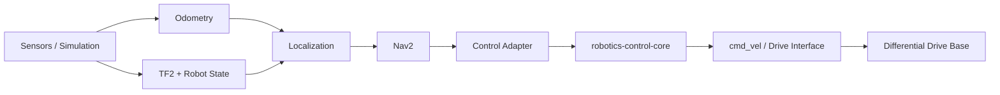

# ROS 2 Autonomous Mobile Robot

[](https://github.com/tahazarif10/ros2-autonomous-mobile-robot/actions/workflows/ci.yml)
[](https://docs.ros.org/en/jazzy/)
[](LICENSE)

An engineering-oriented autonomous mobile robot stack built around **ROS 2, C++, Nav2, deterministic testing, and reusable control software**.

The project is intentionally developed in measurable slices. Each milestone must leave behind buildable code, automated verification, and reproducible evidence rather than a demo-only repository.

## Baseline

- ROS 2 **Jazzy Jalisco**
- Ubuntu **24.04**
- C++ for runtime components
- Python for launch/test tooling
- `colcon` + `ament_cmake`
- GitHub Actions CI
- Apache-2.0

## Architecture



The lifecycle-aware control adapter consumes the existing
[`robotics-control-core`](https://github.com/tahazarif10/robotics-control-core)
library at a pinned commit rather than duplicating planner/controller math inside ROS 2 nodes.

## Repository layout

```text
.
├── src/
│   ├── amr_description/      # Robot model and geometry
│   ├── amr_bringup/          # Launch, Nav2 fixture, maps, system composition
│   └── amr_control_adapter/  # Lifecycle ROS 2 boundary around control core
├── docs/
│   ├── ARCHITECTURE.md
│   ├── CONTROL_ADAPTER.md
│   ├── NAV2_FIXTURE.md
│   ├── OBSERVABILITY.md
│   ├── REPLAY.md
│   ├── VERIFICATION.md
│   └── ROADMAP.md
└── .github/workflows/
    └── ci.yml
```

## Current status

**v0.4 replay, observability, and fault injection — complete**

The repository now combines the lifecycle control-core adapter and deterministic
Nav2 fixture with software-level failure handling and replay evidence:

- diagnostics with stable stop reasons and input ages
- NaN, stale-odometry, and stale-path fault injection with zero-command safe stop
- a real rosbag2 sqlite3 fixture generated from checked-in source data
- the same bag replayed twice through the live lifecycle adapter with identical canonical outcomes
- captured bag-span, replay-pacing, command-count, diagnostic-count, and bounded-command metrics
- a missing-TF Nav2 regression that removes `map -> odom` / `odom -> base_link`, verifies `bt_navigator` never becomes ACTIVE, and verifies no non-zero `cmd_vel`
- test-graph isolation so concurrently executed ROS 2 packages cannot contaminate each other's odometry or command topics

The checked-in v0.3 navigation scenario remains a 6 m × 6 m fixture using NavFn
with A* enabled and Regulated Pure Pursuit. All navigation, timing, and replay
results are explicitly scoped to the checked-in software fixtures and are not
physical-hardware or safety-certification claims.

Hosted verification is recorded in [`docs/VERIFICATION.md`](docs/VERIFICATION.md).
Replay and failure-handling contracts are documented in
[`docs/REPLAY.md`](docs/REPLAY.md) and
[`docs/OBSERVABILITY.md`](docs/OBSERVABILITY.md).

## Build

On Ubuntu 24.04 with ROS 2 Jazzy installed:

```bash
source /opt/ros/jazzy/setup.bash
rosdep install --from-paths src --ignore-src -r -y
colcon build --symlink-install
source install/setup.bash
```

Display the robot model:

```bash
ros2 launch amr_bringup display.launch.py
```

Run the deterministic Nav2 fixture manually:

```bash
ros2 launch amr_bringup navigation_loopback.launch.py
```

The end-to-end fixture assertion runs through `colcon test` in CI.

## Engineering goals

- clean TF tree and explicit frame ownership
- deterministic path/control regression tests
- lifecycle-aware ROS 2 nodes
- deliberate QoS choices rather than defaults by accident
- Nav2 integration without reimplementing Nav2
- reuse of standalone control algorithms through a thin ROS 2 adapter
- rosbag-based replay for reproducible regression testing
- simulation before hardware claims
- CI evidence for every merge

See [Architecture](docs/ARCHITECTURE.md), [Control adapter contract](docs/CONTROL_ADAPTER.md), [Nav2 fixture](docs/NAV2_FIXTURE.md), [Verification](docs/VERIFICATION.md), and [Roadmap](docs/ROADMAP.md).

## License

Apache-2.0.
