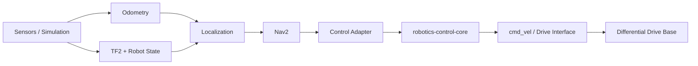

# ROS 2 Autonomous Mobile Robot

[](https://github.com/tahazarif10/ros2-autonomous-mobile-robot/actions/workflows/ci.yml)
[](https://docs.ros.org/en/jazzy/)
[](LICENSE)

An engineering-oriented autonomous mobile robot stack built around **ROS 2, C++, Nav2, deterministic testing, and reusable control software**.

The project is intentionally developed in measurable slices. Each milestone must leave behind buildable code, automated verification, and reproducible evidence rather than a demo-only repository.

## Baseline

- ROS 2 **Jazzy Jalisco**
- Ubuntu **24.04**
- C++ for runtime components
- Python for launch/test tooling
- `colcon` + `ament_cmake`
- GitHub Actions CI
- Apache-2.0

## Architecture



The lifecycle-aware control adapter consumes the existing
[`robotics-control-core`](https://github.com/tahazarif10/robotics-control-core)
library at a pinned commit rather than duplicating planner/controller math inside ROS 2 nodes.

## Repository layout

```text
.
├── src/
│   ├── amr_description/      # Robot model and geometry
│   ├── amr_bringup/          # Launch, Nav2 fixture, maps, system composition
│   └── amr_control_adapter/  # Lifecycle ROS 2 boundary around control core
├── docs/
│   ├── ARCHITECTURE.md
│   ├── CONTROL_ADAPTER.md
│   ├── NAV2_FIXTURE.md
│   ├── VERIFICATION.md
│   └── ROADMAP.md
└── .github/workflows/
    └── ci.yml
```

## Current status

**v0.3 Nav2 integration — complete**

The repository includes the v0.2 lifecycle control-core adapter plus a deterministic Nav2 system fixture built on Nav2's loopback simulator.

The checked-in v0.3 scenario uses:

- a 6 m × 6 m static map
- start pose `(-2.0, 0.0)`
- goal pose `(2.0, 0.0)`
- a central obstacle that blocks the direct path
- NavFn with A* enabled
- Regulated Pure Pursuit
- explicit `map -> odom -> base_link -> base_scan` TF ownership
- documented QoS assumptions
- launch-level assertions for goal success, obstacle clearance, final position tolerance, and a non-trivial detour

Hosted verification is recorded in [`docs/VERIFICATION.md`](docs/VERIFICATION.md), and the fixture contract is documented in [`docs/NAV2_FIXTURE.md`](docs/NAV2_FIXTURE.md).

No hardware-performance claims are made by this repository. Simulation and regression results are scoped only to the exact checked-in fixtures and configurations used to produce them.

## Build

On Ubuntu 24.04 with ROS 2 Jazzy installed:

```bash
source /opt/ros/jazzy/setup.bash
rosdep install --from-paths src --ignore-src -r -y
colcon build --symlink-install
source install/setup.bash
```

Display the robot model:

```bash
ros2 launch amr_bringup display.launch.py
```

Run the deterministic Nav2 fixture manually:

```bash
ros2 launch amr_bringup navigation_loopback.launch.py
```

The end-to-end fixture assertion runs through `colcon test` in CI.

## Engineering goals

- clean TF tree and explicit frame ownership
- deterministic path/control regression tests
- lifecycle-aware ROS 2 nodes
- deliberate QoS choices rather than defaults by accident
- Nav2 integration without reimplementing Nav2
- reuse of standalone control algorithms through a thin ROS 2 adapter
- rosbag-based replay for reproducible regression testing
- simulation before hardware claims
- CI evidence for every merge

See [Architecture](docs/ARCHITECTURE.md), [Control adapter contract](docs/CONTROL_ADAPTER.md), [Nav2 fixture](docs/NAV2_FIXTURE.md), [Verification](docs/VERIFICATION.md), and [Roadmap](docs/ROADMAP.md).

## License

Apache-2.0.
